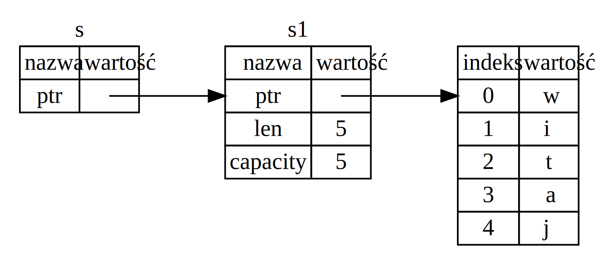

## Referencje i pożyczanie

Z rozwiązaniem z krotką zastosowanym na listingu 4-5 związana jest taka niedogodność,
że musieliśmy zwrócić `String` do funkcji wywołującej, by ta mogła dalej z niego korzystać
(po wywołaniu `calculate_length`). Było tak dlatego że wspomniany `String` był przenoszony do `calculate_length`.
Funkcję `calculate_length` można jednak zdefiniować tak, by jako parametr przekazywana była jedynie referencja do obiektu i dzięki temu nie był on przez `calculate_length` przejmowany na własność.
*Referencja* jest podobna do wskaźnika. Jest ona adresem pod którym przechowywane są dane i dzięki niej możemy uzyskać do nich dostęp. Dane te są własnością innej zmiennej.
W przeciwieństwie do wskaźnika, referencja daje gwarancję, że przez cały czas swojego życia, będzie wskazywać na poprawną wartość danego typu.

Oto jak zdefiniować i użyć funkcji `calculate_length`, która jako parametr otrzymuje referencję do obiektu:

<span class="filename">Plik: src/main.rs</span>

```rust
{{#rustdoc_include ../listings/ch04-understanding-ownership/no-listing-07-reference/src/main.rs:all}}
```
Po pierwsze proszę zauważyć, że krotki nie są nam już dalej potrzebne. Nie ma ich ani przy deklaracji zmiennej, ani w typie zwracanym przez funkcję `calculate_length`. Po drugie, proszę zwrócić uwagę, że przekazujemy do tej funkcji `&s1` oraz, że typ jej parametru został zmieniony z `String` na `&String`.
Te ampersandy oznaczają *referencje* (ang. references) i pozwalają na odnoszenie się (referowanie) do wartości bez przejmowania jej na własność. Jest to zilustrowane na Rysunku 4-5.



<span class="caption">Rysunek 4-5: `&String s` wskazuje na `String s1`</span>

> Uwaga: Przeciwieństwem referowania za pomocą `&` jest *dereferowanie*,
> które realizowane jest za pomocą operatora dereferencji, `*`.
> W rozdziale 8 przedstawiono przykładowe zastosowania operatora dereferencji,
> zaś więcej szczegółów na jego temat można znaleźć w rozdziale 15.

Przyjrzyjmy się nieco bliżej temu wywołaniu funkcji:

```rust
{{#rustdoc_include ../listings/ch04-understanding-ownership/no-listing-07-reference/src/main.rs:here}}
```
Składnia `&s1` tworzy referencję, która co prawda *referuje* do `s1`, ale nie posiada go na własność.
Skoro zaś go nie posiada, to wskazywana przez nią wartość nie zostanie zwolniona wraz z końcem zasięgu życia samej referencji.

Sygnatura funkcji także używa `&` do wskazania, że `s` jest referencją. Poniżej dodano kilka komentarzy z wyjaśnieniami:

```rust
{{#rustdoc_include ../listings/ch04-understanding-ownership/no-listing-08-reference-with-annotations/src/main.rs:here}}
```
Zasięg, w którym zmienna `s` posiada ważność, jest taki sam jak zasięg każdego innego parametru funkcji.
Jednakże, ponieważ `s` nie posiada tego, na co wskazuje, to nie jest to kasowane gdy `s` wyjdzie poza swój zasięg.
W przeciwieństwie do argumentów przekazywanych przez wartość, te przekazywane przez referencje nie są funkcji dawane na własność.
Dlatego też funkcja nie musi więcej zwracać ich za pomocą `return`, by je oddać.

Przekazywanie referencji jako parametrów funkcji nazywamy *pożyczaniem* (ang. borrowing).
I jak w prawdziwym życiu, jeśli ktoś coś posiada, możemy to od niego pożyczyć.
W końcu jednak musimy mu to także oddać.

Co więc się stanie gdy spróbujemy zmodyfikować coś, co pożyczyliśmy?
Wypróbujmy kod z listingu 4-6. Uwaga: on nie zadziała!

<span class="filename">Plik: src/main.rs</span>

```rust,ignore,does_not_compile
{{#rustdoc_include ../listings/ch04-understanding-ownership/listing-04-06/src/main.rs}}
```

<span class="caption">Listing 4-6: Próba modyfikacji pożyczonej wartości</span>

Otrzymamy następujący błąd:

```console
{{#include ../listings/ch04-understanding-ownership/listing-04-06/output.txt}}
```

Tak jak zmienne, referencje są domyślnie niemutowalne.
Nie możemy zmieniać czegoś do czego mamy referencję.

### Referencje mutowalne

Możemy wyeliminować błąd z kodu z listingu 4-6 wprowadzając drobną poprawkę, by używać *mutowalnej referencji* (*mutable reference*):

<span class="filename">Plik: src/main.rs</span>

```rust
{{#rustdoc_include ../listings/ch04-understanding-ownership/no-listing-09-fixes-listing-04-06/src/main.rs}}
```

Po pierwsze, zmieniliśmy `s` by było `mut`. Następnie, w miejscu wywołania funkcji `zmien` utworzyliśmy mutowalną referencję za pomocą `&mut s` i ją przyjęliśmy za pomocą `some_string: &mut String` w sygnaturze funkcji.
Taka składnia czytelnie pokazuje, że funkcja `zmien` będzie zmieniać wartość, którą pożycza.

Jednakże mutowalne referencję posiadają jedno spore ograniczenie: w danym zasięgu można mieć tylko jedną mutowalną referencję do konkretnych danych. Ten kod nie skompiluje się:

<span class="filename">Plik: src/main.rs</span>

```rust,ignore,does_not_compile
{{#rustdoc_include ../listings/ch04-understanding-ownership/no-listing-10-multiple-mut-not-allowed/src/main.rs:here}}
```

Otrzymamy następujący błąd:

```console
{{#include ../listings/ch04-understanding-ownership/no-listing-10-multiple-mut-not-allowed/output.txt}}
```

This error says that this code is invalid because we cannot borrow `s` as
mutable more than once at a time. The first mutable borrow is in `r1` and must
last until it’s used in the `println!`, but between the creation of that
mutable reference and its usage, we tried to create another mutable reference
in `r2` that borrows the same data as `r1`.

To ograniczenie pozwala na mutowalność jedynie w bardzo kontrolowany sposób.
Może ono być kłopotliwe dla początkujących rustowców, gdyż większość innych języków nie nakłada podobnych ograniczeń.
Korzyścią z tego ograniczenia jest to, że Rust może zapobiec tzw. *wyścigom do danych* (ang. *data races*) i to już na etapie kompilacji. *Wyścig do danych* podobny jest do *wyścigu* (ang. *race condition*) i ma miejsce, gdy zachodzą następujące trzy warunki:

* W tym samym czasie współistnieją dwa lub więcej wskaźniki umożliwiające dostęp do tych samych danych.
* Przynajmniej jeden z tych wskaźników jest używany do zapisu danych.
* Nie ma żadnego mechanizmu synchronizacji dostępu do danych.

Wyścigi danych powodują niezdefiniowane zachowania i mogą być trudne do zdiagnozowania, wyśledzenia w czasie wykonywania programu i naprawienia; Tymczasem Rust całkowicie im zapobiega, nie kompilując nawet kodu który je zawiera!

Oczywiście zawsze możemy użyć nawiasów klamrowych do stworzenia nowego zasięgu, pozwalając na wiele mutowalnych referencji, ale nie *równocześnie*:

```rust
{{#rustdoc_include ../listings/ch04-understanding-ownership/no-listing-11-muts-in-separate-scopes/src/main.rs:here}}
```

Podobne ograniczenie dotyczy mieszania referencji mutowalnych z niemutowalnymi. Następujący kod nie skompiluje się:

```rust,ignore,does_not_compile
{{#rustdoc_include ../listings/ch04-understanding-ownership/no-listing-12-immutable-and-mutable-not-allowed/src/main.rs:here}}
```

Kompilator wyświetli następujący komunikat błędu:

```console
{{#include ../listings/ch04-understanding-ownership/no-listing-12-immutable-and-mutable-not-allowed/output.txt}}
```

Fiu, fiu! Mutowalnej referencji nie możemy mieć *także* gdy mamy niemutowalną.

Użytkownicy niemutowalnej referencji nie spodziewają się, że wartość do której ta referencja się odnosi, może się nagle zmienić! Jednakże, istnienie wielu niemutowalnych referencji niczemu nie zagraża, bo nie dają one możliwość zmiany danych i wpłynięcia na to, co odczytają inni.

Uwaga: zasięg życia referencji zaczyna się w miejscu jej utworzenia, kończy się zaś w miejscu jej ostatniego użycia. Przykładowo, następujący kod skompiluje się, bo ostatnie użycie niemutowalnej referencji, `println!`, występuje przed wprowadzeniem mutowalnej:

```rust,edition2021
{{#rustdoc_include ../listings/ch04-understanding-ownership/no-listing-13-reference-scope-ends/src/main.rs:here}}
```

Zasięgi życia niemutowalnych referencji `r1` i `r2` kończą się zaraz po `println!` w którym są one ostatni raz użyte, czyli przed utworzeniem mutowalnej referencji `r3`. Te zasięgi się nie zazębiają i dlatego kompilator ten kod akceptuje.

Błędy kompilacji związane z pożyczaniem mogą być czasami frustrujące. Pamiętajmy jednak, że nierzadko wskazują one potencjalne błędy, dokładnie wskazując problem, i to na wczesnym etapie, w czasie kompilacji, a nie wykonywania programu.
Dzięki nim nie musimy odkrywać, dlaczego nasze dane są inne niż się spodziewaliśmy.

### Wiszące referencje

W językach ze wskaźnikami, łatwo jest błędnie stworzyć *wiszący wskaźnik*, tj. taki, który odnosi się do miejsca w pamięci, które mogło być przekazane komuś innemu, poprzez zwolnienie  pamięci przy jednoczesnym zachowaniu wskaźnika do niej. W Ruście natomiast, kompilator gwarantuje, że referencje nigdy nie będą wiszące: kompilator zawsze dba o to, aby jakiekolwiek dane nie wyszły poza zasięg wcześniej, niż referencje do tych danych.

Spróbujmy utworzyć wiszącą referencję. Rust nam to uniemożliwi, zgłaszając następujący błąd kompilacji:

<span class="filename">Plik: src/main.rs</span>

```rust,ignore,does_not_compile
{{#rustdoc_include ../listings/ch04-understanding-ownership/no-listing-14-dangling-reference/src/main.rs}}
```

Komunikat błędu:

```console
{{#include ../listings/ch04-understanding-ownership/no-listing-14-dangling-reference/output.txt}}
```

This error message refers to a feature we haven’t covered yet: lifetimes. We’ll
discuss lifetimes in detail in Chapter 10. But, if you disregard the parts
about lifetimes, the message does contain the key to why this code is a problem:

Ten komunikat odnosi się do czegoś, czego jeszcze nie omawialiśmy: czasów życia (ang. lifetimes).
Będziemy omawiać je szczegółowo w rozdziale 10. Pomijając jednak części o czasie życia, wiadomość zawiera jasne wskazanie problemu związanego z naszym kodem:

```text
this function's return type contains a borrowed value, but there is no value
for it to be borrowed from
```

Przyjrzyjmy się dokładnie temu, co dzieje się na każdym etapie kodu `dangle`:

<span class="filename">Plik: src/main.rs</span>

```rust,ignore,does_not_compile
{{#rustdoc_include ../listings/ch04-understanding-ownership/no-listing-15-dangling-reference-annotated/src/main.rs:here}}
```

Jako że `s` jest tworzony wewnątrz `dangle`, to jest on zwalniany wraz z końcem `dangle`.
Jednocześnie próbujemy zwrócić referencję do `s`. Ta referencja wskazywałaby na nieprawidłowy `String`. To niedobre!
Rust nie pozwoli nam tego zrobić.

Rozwiązaniem jest zwrócenie `String`a bezpośrednio:

```rust
{{#rustdoc_include ../listings/ch04-understanding-ownership/no-listing-16-no-dangle/src/main.rs:here}}
```

To działa bez żadnych problemów. Własność jest przenoszona na zewnątrz i nic nie jest zwalniane.

### Zasady dotyczące referencji

Podsumujmy informacje na temat referencji:

* W każdej chwili możesz mieć *albo* jedną referencję mutowalną *albo* dowolną liczbę referencji niemutowalnych.
* Referencje zawsze muszą być poprawne.

Wkrótce przyjrzymy się innemu rodzajowi referencji: wycinkowi (ang. slice).
